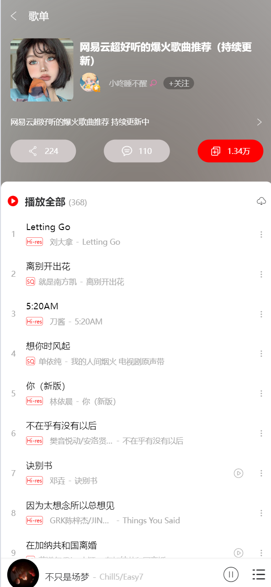

# cloudMusic

#### 介绍
某音乐项目仿写，项目支持音乐播放、音量调节、扫码登录，搜索，视频MV播放，歌词等功能

#### 安装教程

1.  克隆项目
2.  执行npm install命令
3.  使用HBuilderX运行到想要运行的浏览器

#### 技术栈

uniapp + vue + scss

#### 项目预览图

    
    
    
    
    
    
    
    
    
    
    
    
    
    

#### 问题总结
##### 一、给对象添加属性时，视图不更新
###### 原因：无法响应data中已经赋值过的对象或数组
###### 解决：使用this.$set()强制更新试图
